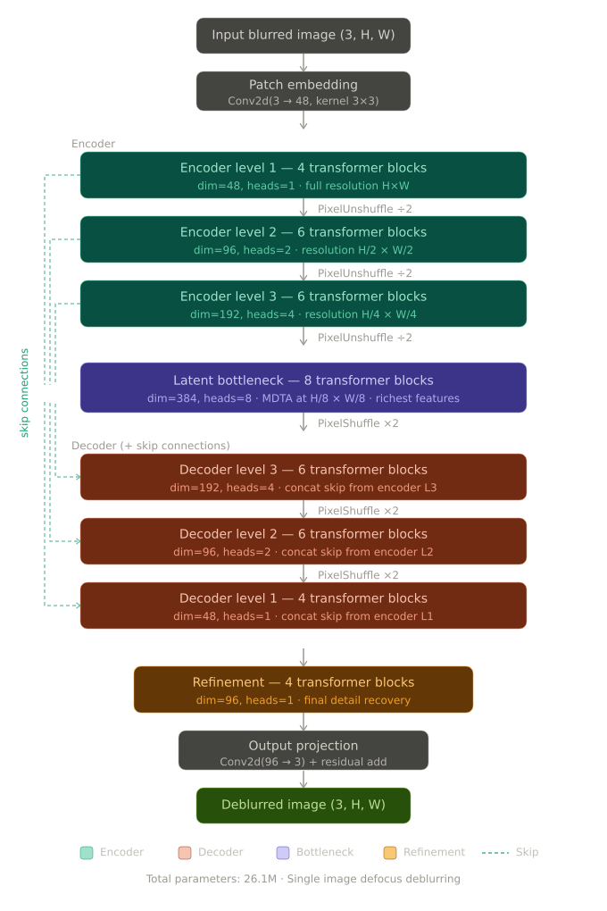

# Restormer-STR

A staged pipeline for reading text off **defocus-blurred document pages** — the
case where OCR fails not because the layout is hard but because the glyph edges
have been destroyed by the camera's focus.

```
 blurred page ──▶ Restormer ──▶ EasyOCR ──▶ TrOCR ──▶ transcript
                  (deblur)      (detect)    (read)
```

Final year project. Built on the [focusStep](docs/dataset.md) corpus of
synthetically defocused text pages.

---

## Why staged, and why these models

Restoration and recognition are usually studied apart. The premise here is that
on blurred documents the restoration stage is not cosmetic — it decides whether
the recognition stage has anything to work with at all. Splitting the pipeline
into switchable stages makes that contribution measurable rather than assumed.

| Stage | Model | What it fixes |
|---|---|---|
| 1. Restoration | Restormer, fine-tuned on focusStep | Removes defocus blur; recovers glyph edges |
| 2. Detection | EasyOCR (detector only, `recognizer=False`) | Locates text regions |
| 3. Recognition | `microsoft/trocr-base-printed` | Decodes each region to a string |

<p align="center">
  
</p>

Two findings drove the model choices:

- **Off-the-shelf restoration weights do not transfer.** The official
  `single_image_defocus_deblurring.pth` checkpoint is trained on DPDD natural
  scenes. Applied unchanged to text pages it gave no benefit and slightly
  *degraded* PSNR — dense high-frequency glyph edges are not natural image
  statistics. Fine-tuning on paired focusStep data is what makes the stage
  worth its compute.
- **No separate super-resolution stage.** An earlier version of this pipeline
  ran a Swin2SR 4× upscale between restoration and detection. It's been
  dropped: EasyOCR/TrOCR perform detection and recognition directly on
  Restormer's full-resolution output, and keeping Swin2SR in the diagram was
  actively misleading — the numbers historically reported as "restoration
  quality" in this repo were measured on Swin2SR upscaling the *raw blurred*
  page, with Restormer never in that run (see **Results** below). Removing
  the stage removes that confound instead of leaving it in the architecture
  diagram unexplained.

<p align="center">
  
</p>

Fine-tuning is the difference between a stage that helps and one that doesn't:
the pretrained checkpoint tracks the unrestored input almost exactly, while
fine-tuning on focusStep lifts PSNR by up to +3.2 dB and SSIM by up to +0.18,
with the gap widening as blur gets worse. This comparison is Restormer against
itself (fine-tuned vs. pretrained), measured independently of the OCR stages
below.

---

## Results

<p align="center">
  
</p>

### Fine-tuned vs. pretrained Restormer, by blur level

This part is a real, verified Restormer result. Input, pretrained-checkpoint
output, fine-tuned output, and ground truth, side by side at each defocus
level:

<p align="center">
  
</p>
<p align="center">
  
</p>
<p align="center">
  
</p>
<p align="center">
  
</p>

The fine-tuned output stays legible well past the point where the pretrained
checkpoint's gains over the raw input flatten out — visible confirmation of
the +3.2 dB / +0.18 gap above. This comparison was run on Restormer's own
output against sharp ground truth (`CAM01_focused`), independent of any
downstream OCR stage.

### Previous baseline — superseded, not a Restormer result

Earlier versions of this README quoted a headline table (SSIM 0.7320, PSNR
31.77 dB, 51.0% token exact-match, 83.3% character accuracy) as if it
described the pipeline above. It doesn't, and attributing it to Restormer
would just repeat the mistake this rewrite exists to fix. To be precise about
what that table actually measured:

- It came from **Swin2SR → EasyOCR → TrOCR**, run with `--no-restore` —
  Restormer was not in that pipeline invocation.
- Its SSIM/PSNR compared Swin2SR's output to the *bicubically upscaled raw
  input*, not to sharp ground truth — so it measured how much Swin2SR changed
  the image, not restoration quality. That's also why those scores rose
  slightly as blur got worse, which is backwards for a fidelity metric.
- Only 56 pages, blur levels 2–4, were in that evaluation subset — levels 0–1
  were never covered.

Full breakdown of why those numbers don't mean what they look like they mean:
[docs/results.md](docs/results.md) (kept as-is, unedited, for the record).

### What's actually still open

The one comparison that would justify this architecture — full pipeline
(Restormer → EasyOCR → TrOCR) evaluated against the Swin2SR-only baseline
above, on the same 56 pages — has **not been run end-to-end in this repo**.
`scripts/evaluate.py` has been updated to score Restormer's output against
sharp ground truth once that run happens (see **Layout** below). That's the
next experiment, and it's the one that decides whether this project's premise
holds.

---

## Layout

```
├── src/
│   ├── models/restormer.py              Restormer architecture (MDTA + GDFN, 4-level U-Net)
│   ├── data/focusstep.py                Paired dataset loader, exact-filename matching
│   ├── restoration/
│   │   ├── finetune_restormer.py        Fine-tuning on focusStep
│   │   └── restore.py                   Tiled full-page inference
│   ├── recognition/ocr.py               EasyOCR detection + TrOCR recognition
│   └── pipeline.py                      End-to-end CLI, restoration ablation flag
├── scripts/evaluate.py                  Restored-vs-ground-truth SSIM/PSNR + token/character accuracy → CSV
├── notebooks/
│   └── 01_swin2sr_trocr_pipeline.ipynb  Original exploratory run (Swin2SR baseline), outputs retained for reference
├── docs/                                setup, dataset, methodology, results
└── results/                             Per-image metric CSVs
```

`src/enhancement/swin2sr.py` is no longer called by `pipeline.py` but is left
in the repo rather than deleted, since the original exploratory notebook still
references it.

## Quick start

```bash
pip install -r requirements.txt

# Fine-tune the restoration stage
python -m src.restoration.finetune_restormer \
    --blurred-dir dataset/focusStep/blurred \
    --focused-dir dataset/focusStep/CAM01_focused \
    --pretrained weights/single_image_defocus_deblurring.pth \
    --epochs 30 --freeze-encoder

# Run the full pipeline
python -m src.pipeline \
    --input-dir dataset/raw --output-dir outputs/full \
    --restormer-weights checkpoints/restormer_focusstep_best.pth \
    --save-intermediate

# Ablation: same pipeline without deblurring
python -m src.pipeline --input-dir dataset/raw --output-dir outputs/no_restore --no-restore

# Score restoration quality (restored vs. sharp ground truth) and recognition accuracy
python scripts/evaluate.py \
    --restored-dir outputs/full/restored \
    --gt-image-dir dataset/focusStep/CAM01_focused \
    --pred-dir outputs/full/text --gt-dir dataset/raw
```

Full instructions, including where to put the pretrained weights and the
dataset: [docs/setup.md](docs/setup.md).

## Data is not in this repository

`dataset/` and `dataset_results_*/` total ~2.1 GB and are gitignored. The
directory layout the code expects is documented in
[docs/dataset.md](docs/dataset.md).

## Status

| Component | State |
|---|---|
| Restormer architecture, fine-tuning, and tiled inference | Fine-tuned on focusStep; fine-tuned-vs-pretrained comparison run and verified (+3.2 dB PSNR, +0.18 SSIM) |
| EasyOCR (detect) + TrOCR (read) | Code complete, previously run end-to-end in the Swin2SR-baseline configuration |
| Full pipeline: Restormer → EasyOCR → TrOCR | Wired together in `src/pipeline.py`; **not yet executed end-to-end in this repo** |
| `scripts/evaluate.py` restoration scoring | Updated to compare restored output against sharp ground truth; **not yet run**, since the full pipeline hasn't produced restored output yet |

The honest reading of the current state: Restormer's own deblurring gain is
verified in isolation, and the OCR stages are verified in isolation (on a
different, non-deblurred input). What's still missing is the one run that
connects them — Restormer's output going into EasyOCR/TrOCR — which is the
actual claim this project is built around.

## References

1. Zamir et al. *Restormer: Efficient Transformer for High-Resolution Image Restoration.* CVPR 2022. [arXiv:2111.09881](https://arxiv.org/abs/2111.09881)
2. Li et al. *TrOCR: Transformer-based Optical Character Recognition with Pre-trained Models.* AAAI 2023. [arXiv:2109.10282](https://arxiv.org/abs/2109.10282)
3. Shi et al. *Robust Scene Text Recognition with Automatic Rectification (RARE).* CVPR 2016. [arXiv:1603.03915](https://arxiv.org/abs/1603.03915)
4. Alshawi, Tanha, Balafar. *An Attention-Based Convolutional Recurrent Neural Network for Scene Text Recognition.* IEEE Access, 2024. [doi:10.1109/ACCESS.2024.3352748](https://doi.org/10.1109/ACCESS.2024.3352748)
