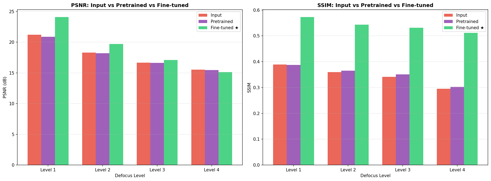
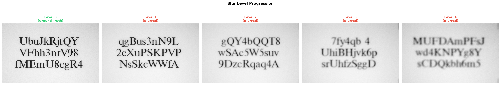
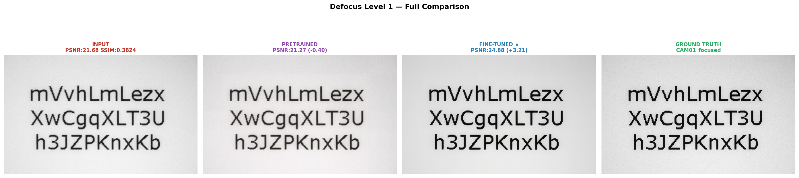
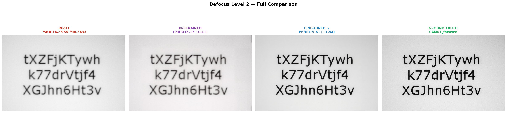
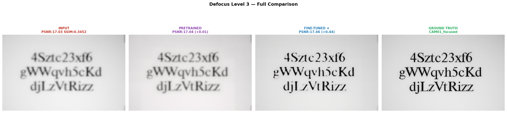
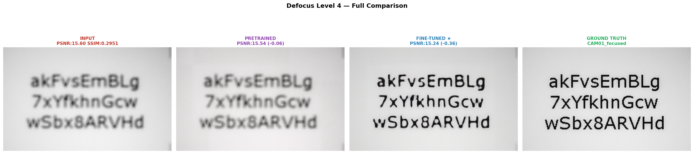

# Restormer-STR

A staged pipeline for reading text off **defocus-blurred document pages** — the
case where OCR fails not because the layout is hard but because the glyph edges
have been destroyed by the camera's focus.

```
 blurred page ──▶ Restormer ──▶ Swin2SR ──▶ EasyOCR ──▶ TrOCR ──▶ transcript
                  (deblur)      (4× SR)     (detect)    (read)
```

Final year project. Built on the [focusStep](docs/dataset.md) corpus of
synthetically defocused text pages.

---

## Why staged, and why these models

Restoration and recognition are usually studied apart. The premise here is that
on blurred documents the restoration stage is not cosmetic — it decides whether
the recognition stage has anything to work with at all. Splitting the pipeline
into switchable stages makes that contribution measurable rather than assumed.

| Stage | Model | What it fixes |
|---|---|---|
| 1. Restoration | Restormer, fine-tuned on focusStep | Removes defocus blur; recovers glyph edges |
| 2. Enhancement | `caidas/swin2SR-realworld-sr-x4-64-bsrgan-psnr` | 4× upscale, so text is physically large enough for the recogniser |
| 3. Detection | EasyOCR (detector only, `recognizer=False`) | Locates text regions |
| 4. Recognition | `microsoft/trocr-base-printed` | Decodes each region to a string |

Two findings drove the model choices:

- **Off-the-shelf restoration weights do not transfer.** The official
  `single_image_defocus_deblurring.pth` checkpoint is trained on DPDD natural
  scenes. Applied unchanged to text pages it gave no benefit and slightly
  *degraded* PSNR — dense high-frequency glyph edges are not natural image
  statistics. Fine-tuning on paired focusStep data is what makes the stage
  worth its compute.
- **Swin2SR over Real-ESRGAN.** Real-ESRGAN was abandoned over `basicsr`
  dependency conflicts, and Swin2SR loads cleanly from HuggingFace with no such
  tangle. An earlier Swin2SR-only attempt also underperformed on the text
  domain, which is part of why a dedicated deblurring stage was added in front
  of it.

<p align="center">
  
</p>

Fine-tuning is the difference between a stage that helps and one that doesn't:
the pretrained checkpoint tracks the unrestored input almost exactly, while
fine-tuning on focusStep lifts PSNR by up to +3.2 dB and SSIM by up to +0.18,
with the gap widening as blur gets worse.

---

## Headline results

Measured on 56 pages at blur levels 2–4. Full tables and caveats in
[docs/results.md](docs/results.md).

<p align="center">
  
</p>

| Metric | Value |
|---|---|
| Restoration SSIM (mean) | 0.7320 |
| Restoration PSNR (mean) | 31.77 dB |
| Recognition, token exact-match | 51.0% |
| Recognition, character accuracy | 83.3% |

The number that matters most is the one that falls apart:

| Blur level | Token exact-match | Character accuracy |
|---|---|---|
| 2 | 53.8% | 89.3% |
| 3 | 61.8% | 87.5% |
| **4** | **10.3%** | **60.1%** |

Recognition holds up through level 3 and then collapses at level 4. Meanwhile
restoration SSIM/PSNR *rise* slightly with blur level — the restoration metric
and the task metric point in opposite directions, which is the central
methodological problem of this project.
[docs/results.md](docs/results.md) explains why.

### Fine-tuned vs. pretrained, by blur level

Input, pretrained-checkpoint output, fine-tuned output, and ground truth,
side by side at each defocus level:

<p align="center">
  
</p>
<p align="center">
  
</p>
<p align="center">
  
</p>
<p align="center">
  
</p>

The fine-tuned output stays legible well past the point where the pretrained
checkpoint's gains over the raw input flatten out — visible confirmation of
the PSNR/SSIM gap above, and consistent with recognition accuracy holding up
through level 3 before collapsing at level 4.

---

## Layout

```
├── src/
│   ├── models/restormer.py              Restormer architecture (MDTA + GDFN, 4-level U-Net)
│   ├── data/focusstep.py                Paired dataset loader, exact-filename matching
│   ├── restoration/
│   │   ├── finetune_restormer.py        Fine-tuning on focusStep
│   │   └── restore.py                   Tiled full-page inference
│   ├── enhancement/swin2sr.py           4× super-resolution, memory-bounded tiling
│   ├── recognition/ocr.py               EasyOCR detection + TrOCR recognition
│   └── pipeline.py                      End-to-end CLI, per-stage ablation flags
├── scripts/evaluate.py                  SSIM/PSNR + token/character accuracy → CSV
├── notebooks/
│   └── 01_swin2sr_trocr_pipeline.ipynb  Original exploratory run, outputs retained
├── docs/                                setup, dataset, methodology, results
└── results/                             Per-image metric CSVs
```

## Quick start

```bash
pip install -r requirements.txt

# Fine-tune the restoration stage
python -m src.restoration.finetune_restormer \
    --blurred-dir dataset/focusStep/blurred \
    --focused-dir dataset/focusStep/CAM01_focused \
    --pretrained weights/single_image_defocus_deblurring.pth \
    --epochs 30 --freeze-encoder

# Run the full pipeline
python -m src.pipeline \
    --input-dir dataset/raw --output-dir outputs/full \
    --restormer-weights checkpoints/restormer_focusstep_best.pth

# Ablation: same pipeline without deblurring
python -m src.pipeline --input-dir dataset/raw --output-dir outputs/no_restore --no-restore

# Score whatever you produced
python scripts/evaluate.py --pred-dir outputs/full/text --gt-dir dataset/raw
```

Full instructions, including where to put the pretrained weights and the
dataset: [docs/setup.md](docs/setup.md).

## Data is not in this repository

`dataset/` and `dataset_results_*/` total ~2.1 GB and are gitignored. The
directory layout the code expects is documented in
[docs/dataset.md](docs/dataset.md).

## Status

| Component | State |
|---|---|
| Swin2SR → EasyOCR → TrOCR | Run end-to-end on 56 pages; metrics reproduced by `scripts/evaluate.py` |
| Evaluation harness | Run; per-image CSVs in `results/` |
| Restormer architecture, training and inference scripts | Written to match the official checkpoint layout; **not yet executed in this repo** — the fine-tuning was done in Colab and is being ported here |

The honest reading of the current numbers: the recognition stage is the
bottleneck at heavy blur, and the restoration stage has not yet been evaluated
inside this pipeline. That comparison is the next piece of work.

## References

1. Zamir et al. *Restormer: Efficient Transformer for High-Resolution Image Restoration.* CVPR 2022. [arXiv:2111.09881](https://arxiv.org/abs/2111.09881)
2. Conde et al. *Swin2SR: SwinV2 Transformer for Compressed Image Super-Resolution and Restoration.* ECCV 2022 Workshops. [arXiv:2209.11345](https://arxiv.org/abs/2209.11345)
3. Li et al. *TrOCR: Transformer-based Optical Character Recognition with Pre-trained Models.* AAAI 2023. [arXiv:2109.10282](https://arxiv.org/abs/2109.10282)
4. Shi et al. *Robust Scene Text Recognition with Automatic Rectification (RARE).* CVPR 2016. [arXiv:1603.03915](https://arxiv.org/abs/1603.03915)
5. Alshawi, Tanha, Balafar. *An Attention-Based Convolutional Recurrent Neural Network for Scene Text Recognition.* IEEE Access, 2024. [doi:10.1109/ACCESS.2024.3352748](https://doi.org/10.1109/ACCESS.2024.3352748)